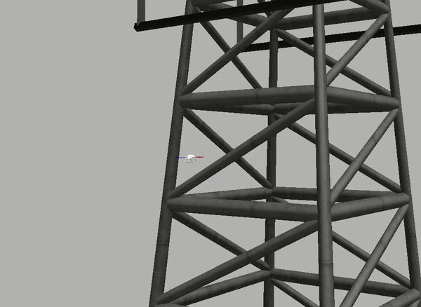

# Motion_Planning_Surveillance_Drones

Unlike ground robots, unmanned aerial vehicles(UAVs) have the inherent advantage of viewing the world in 3D.The high degree of freedom dynamics allow them to maneuver in tight spaces relatively easily. As a result, they have been recently deployed in several applications involving terrain coverage, surveillance, infrastructure monitoring, and civil security.This work particularly focuses on the design and analysis ofmulti-goal path planning algorithms that enable the autonomousapplication of UAVs for high-value infrastructure monitoring. Wepresent the performance comparison between the **anytime multi-goal A-Star** and the anytime **multi-goal RRT-Star** planners in terms of planning time, path cost, and the number of expanded states.Furthermore, we demonstrate the superior performance of the **multi-thread** implementation of a way-point planner for deciding the order of goal location visits. The algorithm comparisons were done on a larger town map as well as a small map of tall buildings generated from the Octomap package in the **Gazebo+RViz** simulation environment. The planners are implemented using **C++17** as a **ROS** package integrated with the ROTORS simulation platform. 
Planners located in **planner** package:
  1. Graph-based: 
    a. Anytime_BT.cpp: For .bt files
    b. AnytimeAstar_MG.cpp: For .ot files
  2. Sampling-based:
    a. RRT.cpp
    b. RRTstar.cpp
 
**Launching Planners**
Launch rotorS simulation (refer to rotorS package README documentation)
```
rosrun planner <name of node> __ns:=firefly
```
**Note: Please replace path of .ot or .bt file in the planner according to folder tree**
